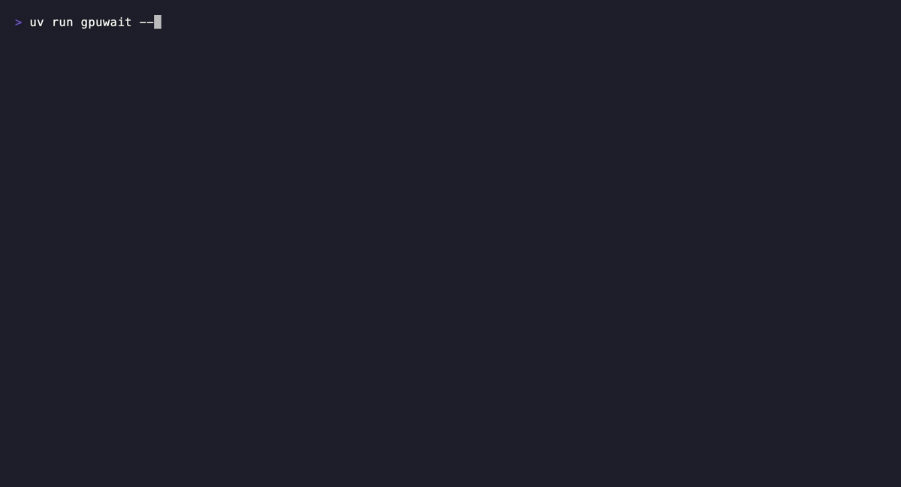

# gpuwait

Measure idle time while replaying requests against a local LLM server. When a
hardware sampler is available, gpuwait reports GPU idle time. Otherwise it
reports the fraction of time with no request in flight, labeled Request Idle
Score. That proxy does not measure GPU activity inside a request.

On this machine, serving Ollama `qwen3:4b` at concurrency 1, the server sat idle (Request Idle
Score, no request in flight) **38.5** percent of a 60 second window. At concurrency 16 that
dropped to **0.0** percent, and p50 request latency rose from 3.1s to 47.6s.
Method: request-timing sampler, measured 2026-09-30, see [Measured numbers](#measured-numbers).




## Why

Every local LLM setup guide tells you to check `nvidia-smi` or Activity Monitor and see the GPU
"working". None of them tell you what fraction of a real session it is actually doing anything.
A GPU that shows 90 percent utilization for a one second burst then sits at 0 percent for three
seconds is not the same as one running hot the whole time, and the difference matters if you are
deciding whether to add concurrency, change a batching setting, or just accept that your workload
is inherently bursty. gpuwait replays a synthetic trace against the server you already run and
reports one number per concurrency level instead of a graph you have to eyeball.

## Install

```
uvx --from git+https://github.com/Arthur031221/gpuwait gpuwait http://localhost:11434
```

`uvx` downloads and runs it in one step with `uv` installed. The project has
not been published to PyPI yet. From a local clone, use:

```
uv run gpuwait http://localhost:11434
```

## Quick start

Start Ollama with a model pulled, then run:

```
uvx --from git+https://github.com/Arthur031221/gpuwait gpuwait http://localhost:11434
```

gpuwait auto-detects the loaded model from `/api/ps` if exactly one is loaded, otherwise pass
`--model qwen3:4b`. It runs three 60 second load levels (concurrency 1, 4, 16 by default),
prints a timeline and summary table, and writes `report.html` and `badge.svg` to the current
directory. Add `--json` to also print a machine-readable report. A full three-level run takes
at least three minutes. An in-flight request may finish after the target
duration, extending the run. Use `--concurrency 1 --duration-s 15` for a fast
check.

## How it works

1. **Sampler.** gpuwait picks one of three ways to measure GPU activity, in this order, and
   never prompts for a password:
   - `powermetrics --samplers gpu_power` on macOS, only if `sudo -n true` already succeeds
     without a prompt (meaning a passwordless sudo rule for it already exists). This is the
     only mode that reads real hardware GPU active residency.
   - `nvidia-smi --query-gpu=utilization.gpu` on Linux, polled once a second. No privilege
     needed.
   - Otherwise, an Ollama `/api/ps` plus request-timing fallback: busy is redefined as "at
     least one HTTP request is outstanding against the server", idle as "zero are". This is
     what runs on a Mac without a passwordless sudo rule, which is most fresh checkouts.
2. **Load generator.** For each concurrency level N, gpuwait runs N independent worker loops
   against `POST {base_url}/v1/chat/completions` (the OpenAI-compatible path every listed
   backend serves) for a fixed duration. Each worker sends a request, waits for the full
   response (streaming-aware: it reads Server-Sent Events chunk by chunk and records time to
   first token), then pauses for `--think-time` seconds (default 2) before its next request.
   That pause matters, see below.
3. **Score.** The idle score at a given concurrency is the average idle percent across
   sampler readings for that level's actual measurement window. The label says
   Request Idle Score for the timing fallback and GPU Idle Score for a hardware
   sampler. The headline number is the concurrency 1 score.

## Why concurrency 1 looks idle, and why that is not a bug

A single simulated user sends a request, waits for the reply, then pauses before the next one,
the same way you read a chat response before typing the next question. During that pause the
server has nothing to do and the GPU is, correctly, idle. That is the entire explanation for a
high idle score at concurrency 1: it reflects the shape of a one-request-at-a-time workload, not
a broken or misconfigured server. As concurrency rises, more independent workers are pausing and
requesting at staggered, uncorrelated times, so the chance that all of them are paused at the same
instant drops fast, and the measured idle percentage drops with it. A server that shows 0 percent
idle at concurrency 16 and 70 percent idle at concurrency 1 is behaving exactly as expected.

What changes the measurement for real traffic: the number of concurrent
requests, the server's batching and parallelism settings, and the time users
spend between turns. A personal assistant does not need a zero idle score.
Higher concurrency can fill the idle gaps while making individual requests
much slower, so inspect latency alongside the score.

## Measured numbers

Ran on the reference machine (MacBook Air M5, 24 GB unified memory) against Ollama `qwen3:4b`
(a reasoning model, `n=12` completed requests at concurrency 1 and `n=34` at concurrency 16),
default prompt and output length (approx 128 tokens each), think time 2 seconds, streaming on,
60 seconds per concurrency level, measured 2026-09-30. Sampler: request-timing fallback (no
passwordless sudo rule for `powermetrics` on this machine, see [How it works](#how-it-works)),
so this measures wall-clock request gaps (whether a request was outstanding), not raw hardware
GPU utilization. The concurrency 1 number is not a defect: it is one simulated user pausing
between messages, exactly like the "why concurrency 1 looks idle" section above explains. It
says more about a one-request-at-a-time workload shape than about this server or model.

| Concurrency | Idle percent | Throughput (tok/s) | p50 latency |
|---|---|---|---|
| 1  | 38.5 | 25.6 | 3.10s  |
| 16 | 0.0  | 38.8 | 47.63s |

Latency, not idle percent, is the number to watch as concurrency rises on a single-model Ollama
server: idle time goes to zero because 16 workers are always queued, but p50 latency rose from
3.1s to 47.6s in the same run, because Ollama was serializing requests against one loaded model
rather than batching them. A zero idle score here is a queue, not a healthy fully-utilized GPU.

Full output of that run: [`docs/report.html`](docs/report.html) ([hosted copy](https://arthur031221.github.io/gpuwait/report.html)), raw data in [`docs/results.json`](docs/results.json).

## Comparison

| Project | What it does | What it lacks versus gpuwait |
|---|---|---|
| Lifeboat | Alternative LLM serving stack aimed at keeping the GPU fed between requests. | Requires switching your serving stack. Does not measure the server you already run. |
| InstinctFlash | Serving engine focused on GPU scheduling for LLM inference. | Same as above: a replacement stack, not a measurement tool for an existing one. |
| floria-serving | LLM serving framework. | Same as above. |
| ServingStudio | Serving and observability platform for LLM deployments. | Built around its own serving layer and dashboards, not a drop-in probe for an arbitrary OpenAI-compatible endpoint. |
| nvtop | Live TUI for GPU (and some NPU) utilization, process list, multi-GPU. | General purpose GPU monitor, no LLM-aware load trace, no single idle score, no per-concurrency comparison, no HTML report. |
| asitop | Apple Silicon system monitor (CPU, GPU, ANE, power) in a TUI. | Last pushed 2024-04-18, system-wide only (no per-process or per-request breakdown), no load generation, no score. |

## Reference

```
gpuwait <base_url> [options]

  base_url                server base URL, e.g. http://localhost:11434

  --model TEXT             model name, autodetected from /api/ps when exactly one is loaded
  --concurrency LIST       comma separated levels, default 1,4,16
  --duration-s N           seconds per level, default 60
  --think-time N           pause between a worker's own requests, default 2.0
  --prompt-tokens N        approx input length, default 128
  --max-tokens N           max output tokens per request, default 128
  --no-stream               disable streaming responses
  --sampler MODE           auto | powermetrics | nvidia-smi | ollama-timing, default auto
  --json                    print the JSON report to stdout
  --report-html PATH        HTML report filename, default report.html
  --out-dir PATH             directory for report.html and badge.svg, default .
  --no-html                  skip writing report.html and badge.svg
  --quiet                    suppress the terminal timeline and table
  --http-timeout-s N        per-request HTTP timeout, default 60
  --version
  --help
```

`--json` output shape:

```json
{
  "tool": "gpuwait",
  "version": "0.1.0",
  "target": "http://localhost:11434",
  "model": "qwen3:4b",
  "headline_idle_percent": 71.4,
  "levels": [
    {"concurrency": 1, "idle_percent": 71.4, "busy_percent": 28.6, "throughput_tok_s": 19.2, "...": "..."}
  ]
}
```

## Limits and FAQ

- **Does it need sudo?** No. It checks `sudo -n true` non-interactively and only uses
  `powermetrics` if that already succeeds without a prompt. Otherwise it falls back to the
  request-timing sampler automatically.
- **Does the request-timing sampler measure real GPU utilization?** No. It measures whether a
  request was outstanding, which is a proxy. It cannot see activity inside a single request.
  Use the `powermetrics` or `nvidia-smi` mode for a hardware measurement.
- **Why can a run take longer than `--duration-s`?** Workers stop starting new requests
  after the target duration, then wait for requests already in flight. The report
  uses the actual elapsed time for its rate calculation.
- **Does it work with vLLM or LM Studio?** Any server exposing an OpenAI-compatible
  `/v1/chat/completions` endpoint works. `/api/ps` is Ollama-specific and only used for model
  autodetection and an extra VRAM-residency note, its absence does not stop the tool.
- **Does it train or fine-tune anything?** No, it only sends chat completion requests.
- **What does it not do?** It does not replace your serving stack, change server settings for
  you, or support multi-GPU attribution. It reports one endpoint's idle time, nothing more.

## Related projects

- [gpuwho](https://github.com/Arthur031221/gpuwho): Shows which process is on the GPU right now. gpuwait shows how idle the GPU sits across a request window.
- [llm-doctor](https://github.com/Arthur031221/llm-doctor): A broader diagnostic for the same local serving setup gpuwait measures the concurrency behavior of.
- [mlxtrace](https://github.com/Arthur031221/mlxtrace): Samples power and memory per MLX training step, a narrower measurement than gpuwait's request-level idle time.

## Contributing

See [CONTRIBUTING.md](CONTRIBUTING.md). Issues and pull requests welcome.

## License

MIT, see [LICENSE](LICENSE).
